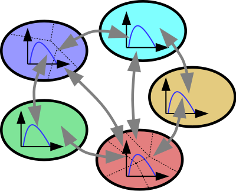

# SymuRes
A Multi-Reservoir MFD-Based Traffic Simulation Platform

Version 1.1 - 2020

License
-------
SymuRes is licensed under the terms of the GNU GPL v3 license.

Acknowledgments
---------------
This simulation platform was developed during the PhD of Guilhem Mariotte. It also received contributions from the PhD thesis of Sérgio F. A. Batista for the traffic assignment part. It is one of the outcomes of the [MAGnUM project](https://magnum-erc.weebly.com/), held by Prof. Ludovic Leclercq and funded by the European Research Council (ERC) under the European Union's Horizon 2020 research and innovation program (grant agreement No 646592).

Authors
-------
- Guilhem Mariotte - guilhem.mariotte@univ-eiffel.fr | [guilhemmariotte.com](http://guilhemmariotte.com/en)
(Simulation platform design, traffic flow solvers, pre-processing and post-processing modules)

- Sergio F. A. Batista - sab21@nyu.edu
(DTA module, assignment and convergence loop)

Designing a simulation
----------------------
In your network folder in the `UserNetworks/` directory, create or edit the scripts `SimulSettings.m` (global settings of the simulation, i.e. duration, timestep, assignment, etc), `ResDef.m` (characteristics of the reservoirs), `DemDef.m` (definition of the macroscopic OD matrix).

Launching a simulation
----------------------
Specify the network, the solver and the name of the output file in the script `Main.m`. Run this script for a classical simulation (with eventually DTA) in the main SymuRes directory. The output of the simulation is always saved into the `outputs/` folder in the corresponding network folder.

Plotting the results of a simulation
------------------------------------
Specify the simulation outputs to load at the beginning of the script `scrPlotResults.m`. Several simulations can be loaded at the same time. Run parts of this script to plot the desired results (accumulations, flows, N-curves, travel times, etc). For each plot script, indicate the relevant list of simulation results, reservoirs, routes to compare.

Version history
===============

V1.0 - Feb 2020
---------------
Original commit

V1.1 - June 2O2O
----------------
Bug fixes in the trip-based solver, add FIFO merge model in the acc-based solver

- AssignCalc.m: put the calculation of route demand here instead of the acc-based solver, when the routes are not predefined
- MFDsolver folder: add the mergeFIFO merge function
- MFDsolver folder: rename and typo fixes for the merge functions
- mergetimeFair: return effective times instead of supply times
- MFDsolver_accbased.m: remove route demand calculation at the beginning (now in AssignCalc.m)
- MFDsolver_accbased.m: fix the queue factor update for the queuedyn model
- MFDsolver_accbased.m: add demfifo option
- MFDsolver_tripbased.m: fix exit supply times per route equal to global entry supply time (FIFO behavior in a succession of reservoirs)
- MFDsolver_tripbased.m: remove waiting veh list per route, keep the global list and add FirstVehPerRoute for exit per route
- MFDsolver_tripbased.m: fix desired entry times within a route (equal to desired exit times of prev reservoir)
- MFDsolver_tripbased.m: fix entry times calculation for demfifo
- MFDsolver_tripbased.m: missing simulation factor on some variables
- MFDsolver_tripbased.m: use directly route demand at the beginning (because now always calculated in AssignCalc.m)
- MFDsolver_tripbased.m: remove MFD linear approximation and apply the simulation factor on MFD param directly
- FDfunctions folder: change variable names of all functions (only inside the functions)
- FDfunctions folder: add conditions (0 <= n).*(n < nj) for the function domain definition
- FDfunctions folder: every function param should be acc or prod (scalable param when using the simu factor in trip-based)
- FDfunctions folder: remove obsolete functions
- Utilityfunctions: add function smoothroute2.m for exact node interpolation
- plotMacroNodes.m: add smoothing option with smoothroute2.m when drawing route paths
- plotRoutes.m: same modification as in plotMacroNodes.m, and now can plot macro nodes
- plotLinkReservoirs.m: plot links and nodes for the given reservoir list only (instead of the full network)
- Main.m: minor typo fixes
